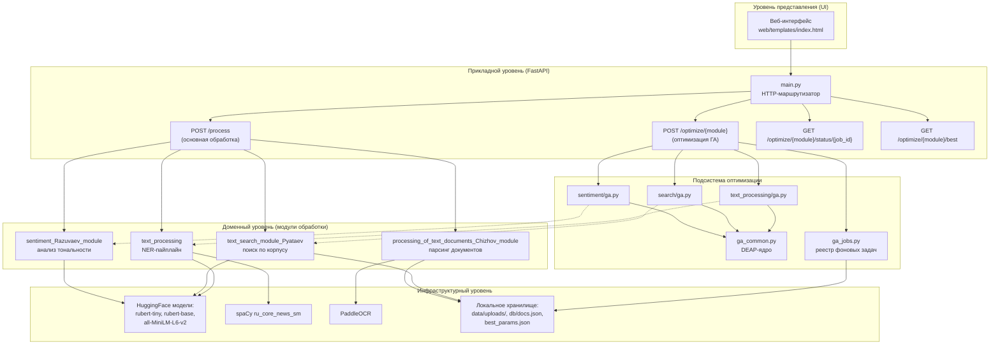
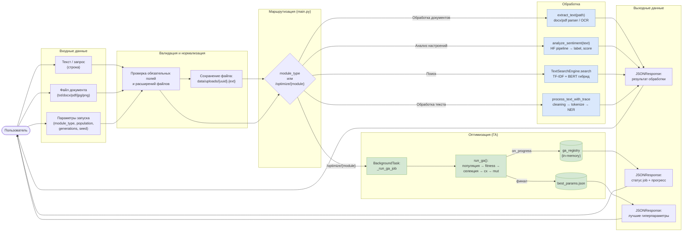
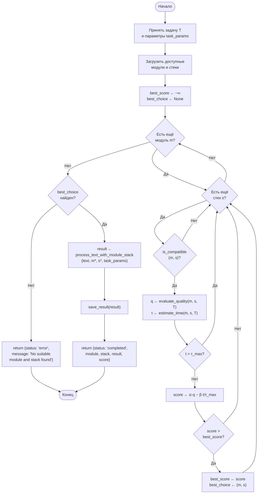
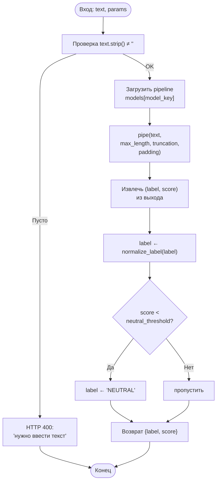
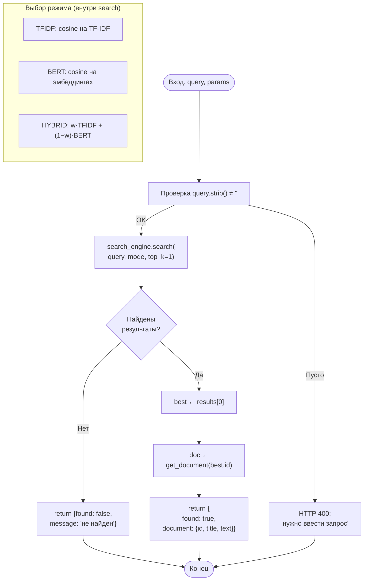
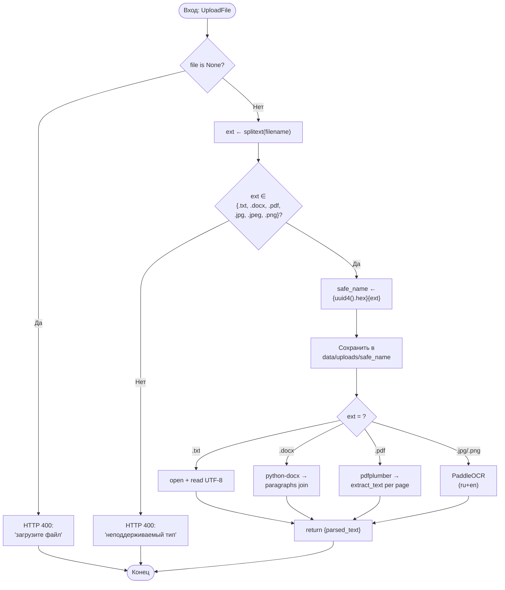
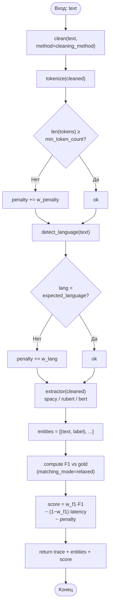
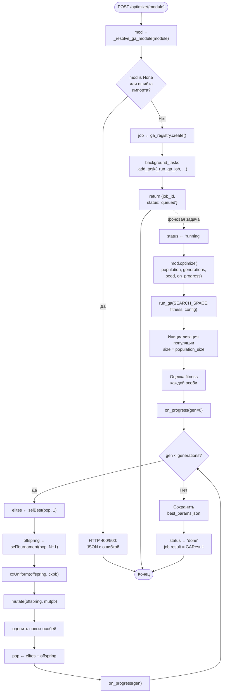
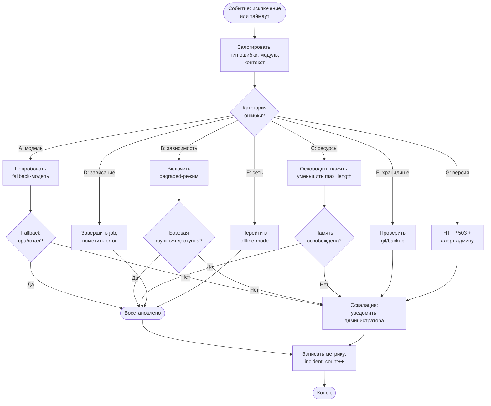
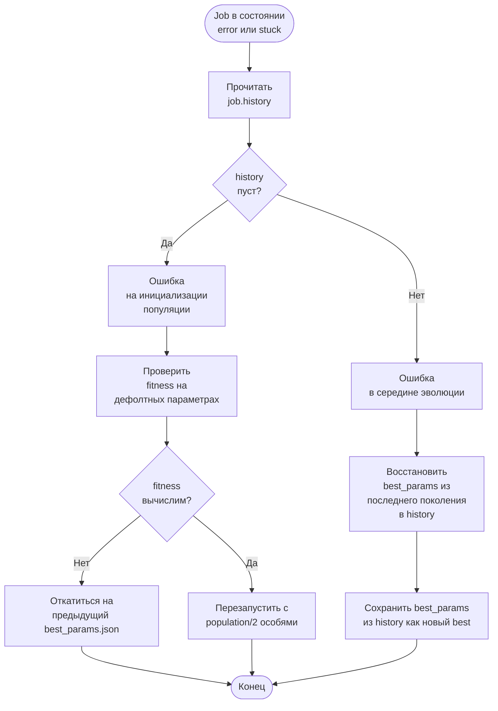

# Сопроводительный документ к техническому заданию

**на выполнение работ по реализации программного продукта, осуществляющего обработку текста**

---

Настоящий сопроводительный документ предназначен для систематизации и
формализации процесса выбора модулей платформы и соответствующего
технологического стека при решении различных прикладных задач обработки
текстовых данных. Он служит методическим руководством для проектирования
архитектуры интеллектуальной системы, учитывающей как тип задачи, так и
особенности условий её выполнения, включая возможность адаптации системы в
экстренных и внештатных ситуациях.

Документ включает следующие разделы:

1. **Общая организационная диаграмма** — иерархическая структура платформы,
   взаимодействие модулей, связи между подсистемами и основные уровни
   управления.
2. **Схема потоков данных** — движение информации между компонентами системы,
   от входных данных через этапы обработки до выдачи результатов.
3. **Математическая постановка общей оптимизационной задачи** — формализация
   задачи выбора оптимальной конфигурации модулей и стека технологий на основе
   критериев качества, времени выполнения и ресурсных ограничений.
4. **Формализация общей задачи в виде блок-схемы и псевдокода** —
   алгоритмическое описание общего подхода к решению оптимизационной задачи.
5. **Постановка отдельной задачи для каждого типа с ограничениями** —
   декомпозиция общей задачи на частные случаи для каждого из реализованных
   модулей с учётом специфических ограничений.
6. **Формализация задач в виде блок-схем по каждому типу задачи (модулю)** —
   визуализация логики работы каждого специализированного модуля.
7. **Набор действий по реконфигурации системы при экстренных/внештатных
   ситуациях** — алгоритм действий и принципы перенастройки системы в случае
   отказов, перегрузок и других непредвиденных ситуаций.

---

## 1. Общая организационная диаграмма

Платформа построена по слоёвой архитектуре: тонкий клиентский слой передаёт
запрос в FastAPI-приложение, которое маршрутизирует его в один из специализированных
модулей. Модули используют общий слой моделей и хранилищ. Подсистема
оптимизации (генетический алгоритм) функционально перпендикулярна основному
потоку и подбирает гиперпараметры каждого модуля.



**Уровни управления:**

| Уровень | Ответственность | Реализация |
|---|---|---|
| Представление | Ввод запроса, визуализация результата и прогресса ГА | `web/templates/index.html`, `web/static/` |
| Прикладной | Маршрутизация, валидация, оркестрация фоновых задач | `main.py`, FastAPI BackgroundTasks |
| Доменный | Бизнес-логика модулей обработки текста | 4 модуля под `source/v2/rus_text_platform/` |
| Оптимизация | Эволюционный подбор гиперпараметров | `ga_common.py`, `ga_jobs.py`, `*/ga.py` |
| Инфраструктура | ML-модели, OCR, файловое хранилище | HuggingFace, spaCy, PaddleOCR, локальный диск |

---

## 2. Схема потоков данных

Схема показывает прохождение информации от пользовательского запроса до
сохранённого результата для двух основных сценариев — **обработка** (синяя
ветвь) и **оптимизация** (зелёная ветвь).



**Описание основных потоков:**

| Поток | Источник → приёмник | Тип данных | Размер |
|---|---|---|---|
| Запрос обработки | UI → `POST /process` | `multipart/form-data` | до 10 МБ (файл) |
| Извлечённый текст | парсер → модуль обработки | `str` | до 1 МБ |
| Результат обработки | модуль → `JSONResponse` | `dict` | ~1–100 КБ |
| Прогресс ГА | `_run_ga_job` → `ga_registry` | `JobState.history[]` | ~1 КБ/поколение |
| Опрос статуса | UI → `GET /status/{job_id}` (1 раз/сек) | `JSON` | ~5 КБ |
| Лучшие параметры | `run_ga` → `best_params.json` | `JSON` | ~10 КБ |

---

## 3. Математическая постановка общей оптимизационной задачи

### 3.1. Цель

**Максимизировать качество и эффективность обработки текста** путём выбора
оптимального модуля платформы и соответствующего технологического стека (набора
гиперпараметров) для каждой поступающей задачи.

### 3.2. Параметры выбора

- $m_i \in M$ — модуль платформы из конечного множества доступных модулей
  $M = \{m_1, m_2, \ldots, m_{|M|}\}$;
- $s_j \in S(m_i)$ — стек технологий (конфигурация гиперпараметров) из
  множества стеков, совместимых с модулем $m_i$.

### 3.3. Входные данные

- $T$ — задача, описываемая кортежем $T = (\text{тип}, \text{язык},
  \text{требуемая точность}, \text{время отклика})$;
- $\Theta_{m_i}$ — пространство параметров для настройки модуля $m_i$;
- $R = (R_{cpu}, R_{ram}, R_{gpu})$ — доступные вычислительные ресурсы;
- $C = (\tau_{max}, \text{Compat})$ — внешние ограничения (порог времени,
  таблица совместимости).

### 3.4. Целевая функция

Пусть $f(m_i, s_j, T)$ — функция оценки качества решения при выборе модуля
$m_i$ и стека $s_j$ для задачи $T$. Она агрегирует три компонента:

$$
f(m_i, s_j, T) = \alpha \cdot Q(m_i, s_j, T) - \beta \cdot \frac{t(m_i, s_j, T)}{\tau_{max}} - \gamma \cdot \rho(m_i, s_j, T)
$$

где:

- $Q(m_i, s_j, T) \in [0, 1]$ — нормированная метрика качества (accuracy / F1 / MRR);
- $t(m_i, s_j, T)$ — время обработки выбранной пары $(m_i, s_j)$;
- $\rho(m_i, s_j, T) \in [0, 1]$ — относительное использование ресурсов;
- $\alpha, \beta, \gamma \ge 0$ — весовые коэффициенты, $\alpha + \beta + \gamma = 1$.

Введём бинарную переменную решения
$x_{ij} \in \{0, 1\}$, где $x_{ij} = 1$ означает выбор пары $(m_i, s_j)$.

Целевая функция максимизации:

$$
\max_{x_{ij}} \sum_{i=1}^{|M|} \sum_{j=1}^{|S(m_i)|} x_{ij} \cdot f(m_i, s_j, T)
$$

### 3.5. Ограничения

**Ограничение единственности выбора** — для одной задачи выбирается ровно один
модуль и ровно один стек:

$$
\sum_{i=1}^{|M|} \sum_{j=1}^{|S(m_i)|} x_{ij} = 1
$$

**Ограничение по времени отклика** — фактическое время обработки не превышает
заданный порог $\tau_{max}$:

$$
\sum_{i,j} x_{ij} \cdot t(m_i, s_j, T) \le \tau_{max}
$$

**Ограничение по качеству** — выбранное решение должно обеспечивать качество
не ниже требуемого порога $Q_{min}$, заданного в $T$:

$$
\sum_{i,j} x_{ij} \cdot Q(m_i, s_j, T) \ge Q_{min}
$$

**Ограничения совместимости** — модуль должен поддерживать выбранный стек:

$$
x_{ij} = 0, \quad \text{если } \text{Compat}(m_i, s_j) = 0
$$

**Ресурсные ограничения** — использование вычислительных ресурсов не должно
превышать доступный объём:

$$
\sum_{i,j} x_{ij} \cdot r_{cpu}(m_i, s_j) \le R_{cpu}, \quad
\sum_{i,j} x_{ij} \cdot r_{ram}(m_i, s_j) \le R_{ram}
$$

### 3.6. Итоговая постановка

$$
\boxed{
\begin{aligned}
& \max_{x_{ij}} \sum_{i,j} x_{ij} \cdot f(m_i, s_j, T) \\
& \text{при условиях:} \\
& \sum_{i,j} x_{ij} = 1 \\
& \sum_{i,j} x_{ij} \cdot t(m_i, s_j, T) \le \tau_{max} \\
& \sum_{i,j} x_{ij} \cdot Q(m_i, s_j, T) \ge Q_{min} \\
& x_{ij} = 0 \text{ если } \text{Compat}(m_i, s_j) = 0 \\
& x_{ij} \in \{0, 1\}
\end{aligned}
}
$$

Задача относится к классу **0–1 нелинейного программирования с дискретными
переменными выбора**. Точное решение в худшем случае требует перебора
$\sum_i |S(m_i)|$ комбинаций; на практике используется двухуровневая
декомпозиция (см. §4): выбор модуля производится по типу задачи, а внутри
модуля гиперпараметры подбираются генетическим алгоритмом.

---

## 4. Формализация общей задачи в виде блок-схемы и псевдокода

### 4.1. Блок-схема общего алгоритма



### 4.2. Псевдокод

```python
def main_process(text, task_params):
    # Загрузка доступных модулей и стеков
    modules = load_available_modules()        # [sentiment, search, docs, ner]
    stacks  = load_available_stacks()         # per-module hyperparams

    # Инициализация переменных для оптимизации
    best_score  = -inf
    best_choice = None

    # Перебор всех вариантов выбора модуля и стека
    for module in modules:
        for stack in stacks:
            if not is_compatible(module, stack):
                continue   # пропускаем несовместимые пары

            # Оценка качества и времени обработки
            quality          = evaluate_quality(module, stack, text, task_params)
            processing_time  = estimate_time(module, stack, text, task_params)

            # Проверка временного ограничения
            if processing_time > task_params.max_time:
                continue

            # Проверка минимального уровня качества
            if quality < task_params.min_quality:
                continue

            # Интегральная метрика: качество минус нормированный штраф за время
            score = alpha * quality \
                  - beta  * (processing_time / task_params.max_time) \
                  - gamma * resource_usage(module, stack)

            if score > best_score:
                best_score  = score
                best_choice = (module, stack)

    if best_choice is None:
        return {"status": "error",
                "message": "No suitable module and stack found"}

    selected_module, selected_stack = best_choice
    result = process_text_with_module_stack(
        text, selected_module, selected_stack, task_params
    )
    save_result(result)

    return {
        "status": "completed",
        "module": selected_module.name,
        "stack":  selected_stack.name,
        "result": result,
        "score":  best_score,
    }
```

**Сложность.** Внешний цикл — линейный по числу модулей $|M|$ (в нашей системе
$|M| = 4$), внутренний — линейный по числу стеков. На практике гиперпараметры
не перебираются явно во время инференса, а **подбираются заранее** генетическим
алгоритмом (см. §6), и `evaluate_quality` использует кэшированные значения
качества из `best_params.json` каждого модуля.

---

## 5. Постановка отдельной задачи для каждого типа с ограничениями

В платформе реализованы четыре типа задач. Для каждой ниже приведены:
параметры пространства поиска, целевая функция, ограничения, источник
эталонных данных.

### 5.1. Задача 1 — Анализ тональности

**Модуль:** `sentiment_Razuvaev_module`

**Постановка:** для заданного текста $x$ предсказать класс тональности
$y \in \{POSITIVE, NEUTRAL, NEGATIVE\}$.

**Пространство гиперпараметров** $\Theta_1$:

| Параметр | Тип | Область определения |
|---|---|---|
| `model_key` | категориальный | `{rubert_tiny, rubert_base}` |
| `max_length` | категориальный | `{64, 128, 256, 512}` |
| `padding` | категориальный | `{max_length, longest}` |
| `neutral_threshold` | вещественный | $[0.30, 0.95]$ |

Размер дискретной части: $|\Theta_1^{\text{disc}}| = 2 \cdot 4 \cdot 2 = 16$;
непрерывная компонента — порог $\tau_n \in [0.30, 0.95]$.

**Эталон:** `TEST_CASES` из `sentiment_Razuvaev_module/validate.py`
(тестовый набор предложений с разметкой).

**Целевая функция:**

$$
Q_1(\theta) = \frac{1}{|\mathcal{D}|} \sum_{(x_k, y_k) \in \mathcal{D}} \mathbb{1}\!\left[\hat{y}(x_k; \theta) = y_k\right]
$$

где $\hat{y}(x; \theta)$ — предсказание модели с применением порога
$\tau_n$ (если максимальный $score < \tau_n$, метка переводится в $NEUTRAL$).

**Ограничения:**

- $|x| \le \text{max\_length}$ (длинные тексты обрезаются по truncation=True);
- доступен GPU **или** время инференса $\le 5$ с/текст на CPU;
- $\tau_n \ge 0.30$ — нижняя граница, иначе все предсказания становятся
  $NEUTRAL$;
- `rubert_base` требует ~500 МБ RAM, `rubert_tiny` — ~50 МБ.

### 5.2. Задача 2 — Поиск текстовых данных в системе

**Модуль:** `text_search_module_Pyataev`

**Постановка:** для запроса $q$ найти в корпусе $\mathcal{C} = \{d_1, \ldots, d_N\}$
документ $d^*$, наиболее релевантный запросу.

**Пространство гиперпараметров** $\Theta_2$:

| Параметр | Тип | Область определения |
|---|---|---|
| `ngram_max` | категориальный | $\{1, 2, 3\}$ |
| `min_df` | категориальный | $\{1, 2, 3\}$ |
| `max_df` | категориальный | $\{0.80, 0.90, 0.95, 1.00\}$ |
| `sublinear_tf` | категориальный | $\{\text{True}, \text{False}\}$ |
| `tfidf_weight` | вещественный | $[0.0, 1.0]$ |
| `mode` | категориальный | $\{\text{TFIDF}, \text{BERT}, \text{HYBRID}\}$ |

**Эталон:** `TEST_CASES` из `text_search_module_Pyataev/validate.py`
(пары $(q_k, \text{expected\_id}_k)$).

**Скоринговая функция** (для HYBRID):

$$
\text{score}(q, d) = w_{tfidf} \cdot \cos(\vec{v}_{tfidf}(q), \vec{v}_{tfidf}(d)) + (1 - w_{tfidf}) \cdot \cos(\vec{v}_{bert}(q), \vec{v}_{bert}(d))
$$

**Целевая функция (top-1 accuracy):**

$$
Q_2(\theta) = \frac{1}{|\mathcal{D}|} \sum_{(q_k, d^*_k) \in \mathcal{D}} \mathbb{1}\!\left[\arg\max_{d \in \mathcal{C}} \text{score}(q_k, d; \theta) = d^*_k\right]
$$

**Ограничения:**

- $w_{tfidf} + w_{bert} = 1$;
- BERT-эмбеддинги документов **кэшируются** (см. `reuse_embeddings=True`),
  иначе одна оценка fitness занимает >30 с;
- $\min\_df \le \max\_df \cdot N$ — иначе словарь TF-IDF пуст;
- режим `BERT` требует загруженной модели `all-MiniLM-L6-v2` (~80 МБ).

### 5.3. Задача 3 — Обработка текстовых документов

**Модуль:** `processing_of_text_documents_Chizhov_module`

**Постановка:** для входного файла $F$ извлечь текстовое содержимое $T$ в
зависимости от формата.

**Пространство стратегий** $\Theta_3$ (определяется расширением, не подбирается ГА):

| Расширение | Стратегия |
|---|---|
| `.txt` | прямое чтение UTF-8 |
| `.docx` | `python-docx` → конкатенация параграфов |
| `.pdf` | `pdfplumber` → постраничное извлечение |
| `.jpg/.jpeg/.png` | PaddleOCR (ru+en) → распознавание текста |

**Целевая функция (качество извлечения):**

$$
Q_3 = \frac{\text{len}(T_{\text{извлечённый}})}{\text{len}(T_{\text{эталонный}})} \cdot \mathbb{1}\!\left[\text{CER}(T_{\text{извлечённый}}, T_{\text{эталонный}}) < \epsilon\right]
$$

где CER — character error rate, $\epsilon = 0.1$ для OCR, $\epsilon = 0$ для
структурированных форматов.

**Ограничения:**

- расширение $\in \{.txt, .docx, .pdf, .jpg, .jpeg, .png\}$ — иначе возврат
  HTTP 400;
- размер файла $\le 10$ МБ;
- OCR требует CPU ≥2 ядра либо GPU; время обработки одной страницы ≤30 с;
- сохранение под безопасным именем `{uuid4().hex}{ext}` в `data/uploads/`.

### 5.4. Задача 4 — Обработка неструктурированных текстовых данных (NER-пайплайн)

**Модуль:** `text_processing`

**Постановка:** для входного текста $x$ извлечь набор именованных сущностей
$E = \{(t_k, \ell_k)\}$, где $t_k$ — span текста, $\ell_k \in \{PER, LOC, ORG, \ldots\}$.

**Пространство гиперпараметров** $\Theta_4$:

| Параметр | Тип | Область определения |
|---|---|---|
| `cleaning_method` | категориальный | $\{$basic, full, remove\_urls, remove\_stopwords, lemmatize$\}$ |
| `ner_extractor` | категориальный | $\{$spacy, transformers:rubert, transformers:bert$\}$ |
| `w_f1` | вещественный | $[0.5, 0.9]$ |
| `min_token_count` | категориальный | $\{2, 3, 4, 5, 6\}$ |

**Эталон:** `GOLD_SAMPLES` из `text_processing/ga.py` — 5 RU-предложений с
разметкой PER/LOC/ORG; режим сопоставления `relaxed`.

**Целевая функция:**

$$
Q_4(\theta) = w_{f_1} \cdot F_1(\theta) - (1 - w_{f_1}) \cdot \tilde{t}(\theta) - \pi(\theta)
$$

где $\tilde{t}$ — нормированная задержка пайплайна, $\pi$ — сумма штрафов
(нарушение `min_token_count`, ошибки языка и т. д.).

$F_1$ считается стандартным образом по совпадениям предсказанных сущностей с
эталонными:

$$
F_1 = \frac{2 \cdot P \cdot R}{P + R}, \quad P = \frac{TP}{TP + FP}, \quad R = \frac{TP}{TP + FN}
$$

**Ограничения:**

- $w_{f_1} \in [0.5, 0.9]$ — минимум 50 % веса отдаётся качеству;
- модели `transformers:rubert/bert` инициализируются лениво (>400 МБ каждая);
- spaCy-модель `ru_core_news_sm` обязательна для базового режима;
- метод `lemmatize` доступен только при наличии spaCy.

### 5.5. Сводная таблица ограничений

| Модуль | Time ≤ | RAM ≤ | Качество ≥ | Внешние зависимости |
|---|---|---|---|---|
| Sentiment | 5 с/текст | 600 МБ | $Q_1 \ge 0.70$ | HuggingFace rubert-* |
| Search | 2 с/запрос | 200 МБ | $Q_2 \ge 0.80$ | sentence-transformers |
| Docs | 30 с/страница | 1 ГБ | CER < 0.10 | python-docx, pdfplumber, PaddleOCR |
| NER | 3 с/текст | 800 МБ | $F_1 \ge 0.60$ | spaCy ru_core_news_sm, transformers |

---

## 6. Формализация задач в виде блок-схем по каждому типу задачи

### 6.1. Модуль анализа тональности



### 6.2. Модуль поиска



### 6.3. Модуль обработки документов



### 6.4. Модуль обработки текста (NER-пайплайн)



### 6.5. Подсистема оптимизации (общая блок-схема для всех модулей)



---

## 7. Набор действий по реконфигурации системы при экстренных/внештатных ситуациях

В этом разделе описаны типовые внештатные ситуации, их детектирование и
алгоритм автоматического или ручного восстановления работы платформы.

### 7.1. Классификация внештатных ситуаций

| Класс | Описание | Уровень критичности | Время восстановления |
|---|---|---|---|
| **A. Отказ модели** | HuggingFace модель недоступна / повреждена | средний | <1 мин (fallback) |
| **B. Отказ зависимости** | spaCy/PaddleOCR/sentence-transformers не загружается | высокий | 1–5 мин |
| **C. Перегрузка ресурсов** | OOM, CPU > 95% > 30с, GPU OOM | средний | <30 с (offload) |
| **D. Зависание задачи ГА** | поколение не завершается > 10 мин | низкий | <10 с (kill) |
| **E. Повреждение хранилища** | `docs.json` или `best_params.json` нечитаем | высокий | 1 мин (восстановление) |
| **F. Сетевые ошибки** | HF Hub недоступен при первом старте | средний | 0 с (offline mode) |
| **G. Несовместимая версия зависимости** | API библиотеки изменился | критический | требует ручного вмешательства |

### 7.2. Матрица реконфигурации

| Ситуация | Триггер детекции | Действие 1 (автоматическое) | Действие 2 (ручное) |
|---|---|---|---|
| A | `pipeline()` бросает `OSError`/`HTTPError` | переключиться на резервную модель (`rubert_tiny` ← `rubert_base`) | переустановить модель: `huggingface-cli download <model>` |
| B | `import` модуля бросает `ImportError` | вернуть модулю degraded-режим (см. §7.4) | `pip install -r requirements.txt`; для spaCy — `python -m spacy download ru_core_news_sm` |
| C | `MemoryError`, `torch.cuda.OutOfMemoryError` | уменьшить `max_length` вдвое; перейти с GPU на CPU | увеличить квоту RAM/GPU; перезапустить процесс |
| D | таймаут > `2 × generations × estimated_time` | пометить job `status='error'` с описанием; не убивать процесс целиком | проанализировать `history` job-а; сократить `population_size` |
| E | `json.JSONDecodeError` / отсутствует файл | для `docs.json` — отказ модуля; для `best_params.json` — игнорировать (юзаем дефолты) | восстановить из git-репозитория или резервной копии |
| F | `ConnectionError` при первой загрузке | использовать локальный кэш HF (`~/.cache/huggingface/`) | предварительно скачать модели в офлайн-окружении |
| G | `AttributeError` / сигнатура изменилась | вернуть HTTP 503 с уведомлением | закрепить версию в `requirements.txt`, провести регресс-тестирование |

### 7.3. Алгоритм реконфигурации (общая блок-схема)



### 7.4. Degraded-режимы модулей

| Модуль | Полнофункциональный режим | Degraded-режим | Минимальный режим |
|---|---|---|---|
| Sentiment | rubert_base + neutral_threshold | rubert_tiny с дефолтным порогом 0.5 | возврат `{"label": "NEUTRAL", "score": 0.0}` с пометкой `"warning": "model unavailable"` |
| Search | HYBRID (TF-IDF + BERT) | TFIDF only | substring-поиск по `text` поля документов |
| Docs | docx/pdf/OCR | только `.txt` и `.docx` | только `.txt` |
| NER | transformers:rubert | spacy ru_core_news_sm | regex на `[А-ЯA-Z][а-яa-z]+ [А-ЯA-Z][а-яa-z]+` для PER |

Переход в degraded-режим выполняется **на уровне функции `_resolve_module()`**:
вместо исключения возвращается обёртка-fallback с предупреждением в ответе.

### 7.5. Алгоритм восстановления подсистемы оптимизации



### 7.6. Чек-лист для дежурного администратора

При получении уведомления о внештатной ситуации:

1. ☐ Проверить логи `uvicorn` на наличие traceback'ов за последние 5 минут.
2. ☐ Выполнить `curl /optimize/{module}/status/{job_id}` для всех активных jobs.
3. ☐ Проверить занятость ресурсов: `Get-Process python | Sort-Object WS -Desc`.
4. ☐ Проверить, что файлы `docs.json`, `best_params.json` существуют и читаемы.
5. ☐ Проверить доступ к HuggingFace Hub: `python -c "from huggingface_hub import HfApi; HfApi().whoami()"`.
6. ☐ При необходимости — перезапустить сервер: `uvicorn main:app --reload`.
7. ☐ Если проблема воспроизводится — переключить модуль в degraded-режим
   через переменную окружения `FORCE_DEGRADED_<MODULE>=1`.
8. ☐ Записать инцидент в журнал: дата, модуль, симптомы, действия, результат.

### 7.7. Метрики стабильности

Для оперативного мониторинга платформа должна вести метрики:

| Метрика | Источник | Целевое значение |
|---|---|---|
| Доля успешных запросов `/process` | счётчик HTTP 200 / total | ≥ 99 % |
| Среднее время ответа `/process` | время от приёма до возврата | < 3 с |
| Доля завершённых GA-jobs | `done / (done + error)` | ≥ 95 % |
| Средний `best_fitness` после оптимизации | per-module | sentiment ≥ 0.80, search ≥ 0.85, NER ≥ 0.65 |
| Количество переходов в degraded-режим / сутки | счётчик инцидентов | ≤ 5 |
| RAM peak | `psutil.Process().memory_info().peak_wset` | < 4 ГБ |

При выходе любой метрики за порог — автоматическая отправка алерта и
запуск алгоритма реконфигурации из §7.3.

---

## Приложения

### Приложение A. Используемые библиотеки и версии

| Компонент | Библиотека | Версия |
|---|---|---|
| Web | FastAPI, uvicorn | 0.115+, 0.32+ |
| ML | torch (CUDA 12.6), transformers, sentence-transformers | 2.6+, 4.46+, 3.0+ |
| NLP | spaCy + ru_core_news_sm | 3.7+ |
| OCR | PaddleOCR, paddlepaddle | 2.7+, 2.6+ |
| Документы | python-docx, pdfplumber | 1.1+, 0.11+ |
| ГА | DEAP | 1.4.3 |

### Приложение B. Связанные документы

- [GA_README.md](../GA_README.md) — детальное описание генетического
  алгоритма и его реализации в проекте.
- `requirements.txt` — точный список зависимостей.
- `main.py` — реализация HTTP-маршрутизации и оркестрации модулей.
- `*/validate.py` — наборы тестовых случаев для каждого модуля.
